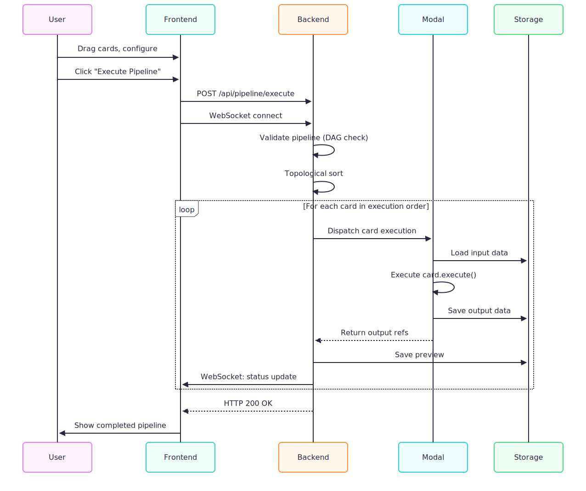
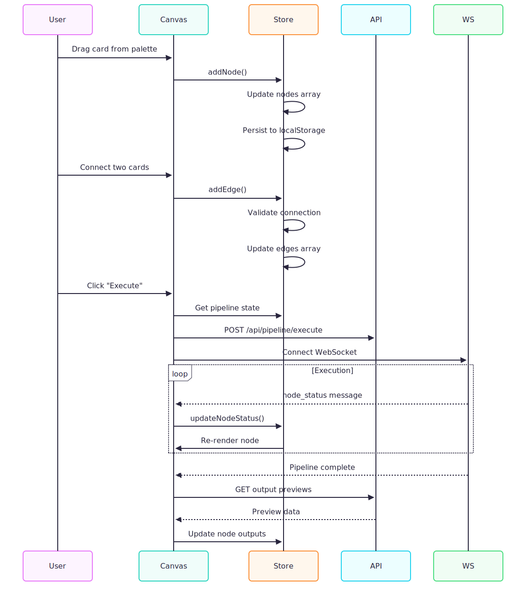
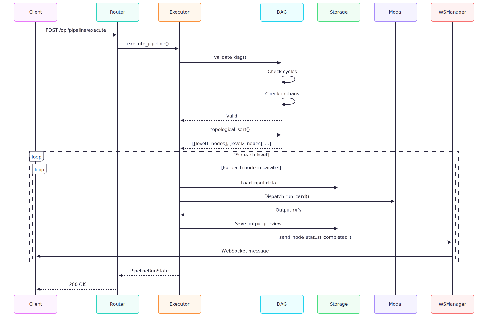
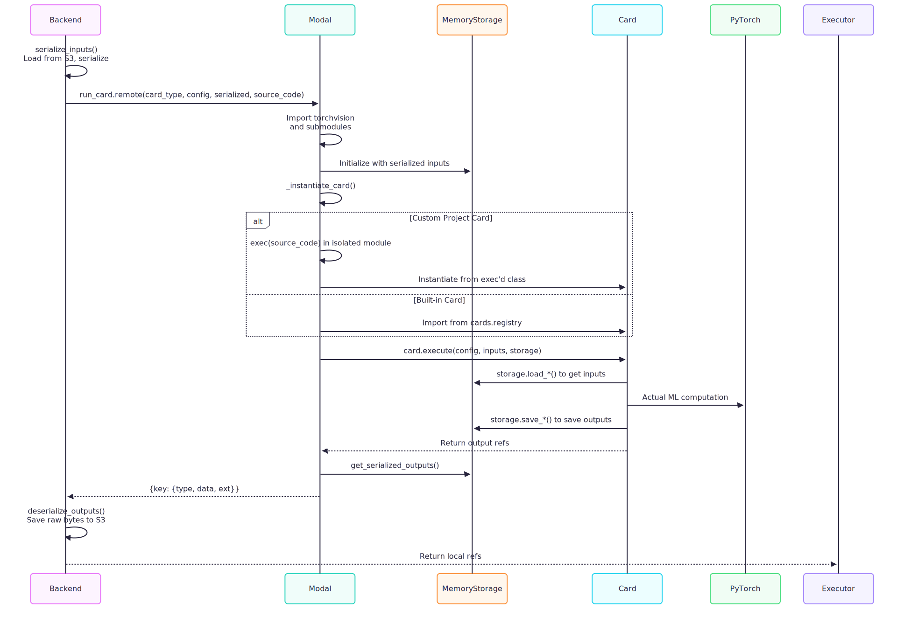
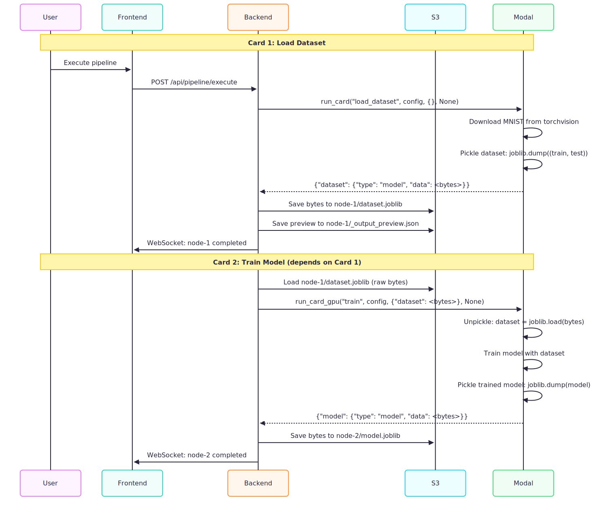

# TensorRag: Complete Architecture Documentation

## Table of Contents

1. [Executive Summary](#executive-summary)
2. [System Overview](#system-overview)
3. [High-Level Architecture](#high-level-architecture)
4. [Frontend Architecture](#frontend-architecture)
5. [Backend Architecture](#backend-architecture)
6. [Modal Execution Layer](#modal-execution-layer)
7. [Data Flow & Storage](#data-flow--storage)
8. [Card Lifecycle](#card-lifecycle)
9. [WebSocket Communication](#websocket-communication)
10. [Workspace & Project Management](#workspace--project-management)
11. [Security & Error Handling](#security--error-handling)
12. [Deployment & Configuration](#deployment--configuration)
13. [Development Guide](#development-guide)

## Executive Summary

**TensorRag** is a visual, DAG-based ML pipeline builder that enables users to create, configure, and execute machine learning workflows through a drag-and-drop interface. The system is built on three core principles:

1. **Card Independence** — Every ML operation is encapsulated in a self-contained "card" component
2. **Serverless Execution** — All compute-intensive operations run on Modal's serverless infrastructure
3. **Visual-First Design** — The React Flow canvas is the primary interface for pipeline construction

### Key Features

- **Visual Pipeline Builder**: Drag-and-drop cards on a canvas, connect them to define data flow
- **Serverless Compute**: Automatic execution on Modal with GPU support for heavy workloads
- **Real-time Monitoring**: Live execution status and logs via WebSocket
- **Inline Output Inspection**: View data tables, metrics, and model summaries at each step
- **Project-Scoped Workspaces**: Organize pipelines and custom cards by project
- **Custom Card Development**: Built-in Monaco editor with validation and IntelliSense

### Technology Stack

| Layer | Technology | Purpose |
|-------|------------|---------|
| **Frontend** | Next.js 14, React 18, TypeScript | Visual interface, state management |
| **UI Framework** | React Flow, Tailwind CSS | Canvas rendering, drag-and-drop |
| **State Management** | Zustand | Client-side state with persistence |
| **Backend API** | FastAPI, Python 3.11+ | Orchestration, validation, storage |
| **Compute** | Modal (Serverless) | ML workload execution with CPU/GPU |
| **Real-time** | WebSocket | Live status updates and logs |
| **Storage** | Local FS / S3-compatible | Data artifacts, pipeline state |

## System Overview

### Architectural Principles


 TensorRag is built on three foundational principles. First, **Card Independence** ensures every component is self-contained with a standard interface, making cards reusable across different pipelines. Second, **Separation of Concerns** cleanly divides responsibilities: the frontend handles only UI, the backend orchestrates workflows, and Modal executes computations. Third, **Data Flow** is explicit and type-safe—every connection between cards is validated, and data artifacts are immutable once created.

### System Context


 This high-level context diagram shows how TensorRag interacts with external systems. ML Engineers use the TensorRag platform to visually create pipelines. When pipelines execute, TensorRag dispatches computations to Modal's serverless infrastructure (which can provision GPUs on-demand). All data artifacts and pipeline state are persisted to S3-compatible storage. Modal containers can download models and datasets from Model repository, and both TensorRag and Modal read/write data to S3 for seamless data transfer between execution steps.

## High-Level Architecture

### Component Diagram


 The system consists of three main layers. The **Client Browser** runs the Next.js frontend with a WebSocket client for real-time updates. The **Backend Server** (localhost:8000) provides REST APIs, manages WebSocket connections, executes pipeline logic, and handles storage operations. The **Modal Cloud** runs actual card computations in isolated containers with either CPU or GPU images, depending on the workload. Storage can be either local filesystem for development or S3-compatible cloud storage for production. All heavy ML computations happen in Modal, keeping the backend lightweight and focused on orchestration.

### Request Flow Overview




 This sequence shows a complete pipeline execution flow. When a user clicks "Execute Pipeline" in the frontend, an HTTP POST request is sent to the backend while a WebSocket connection opens for live updates. The backend validates the pipeline (checking for cycles and missing connections), then sorts cards topologically to determine execution order. For each card, the backend dispatches execution to Modal, which loads input data from storage, runs the card's logic, and saves outputs back to storage. After each card completes, the backend sends real-time status updates through the WebSocket so the user sees progress live. Finally, the backend returns HTTP 200 OK and the frontend displays the completed pipeline with all outputs available for inspection.

## Frontend Architecture

### Component Hierarchy


### State Management


 The frontend uses three Zustand stores for state management. The **Pipeline Store** manages nodes, edges, and execution status—it's persisted to browser localStorage so users don't lose their work on page refresh. The **Editor Store** tracks the currently open file and code content. The **Workspace Store** manages projects and registered cards. Each store is connected to its relevant UI components bidirectionally, allowing components to read state and dispatch updates. This centralized state management eliminates prop drilling and makes the data flow predictable and debuggable.

### Frontend Data Flow



 This sequence illustrates typical user interactions with the frontend. When dragging a card from the palette, the canvas immediately updates the store, which persists to localStorage. Connecting two cards triggers validation before updating the edges array. When executing, the canvas gets the current pipeline state and sends it via API while simultaneously opening a WebSocket connection. During execution, the WebSocket continuously streams status updates that update the store, causing affected nodes to re-render in real-time. After completion, the frontend fetches output previews via REST API and updates the store so users can inspect results. This combines HTTP for data operations with WebSocket for real-time feedback.

### Key Frontend Files

| File Path | Purpose |
|-----------|---------|
| `src/app/page.tsx` | Main application page with tabbed interface |
| `src/store/pipelineStore.ts` | Zustand store for pipeline state (nodes, edges, execution) |
| `src/store/editorStore.ts` | Zustand store for card editor state |
| `src/store/workspaceStore.ts` | Zustand store for workspace/project management |
| `src/components/canvas/PipelineCanvas.tsx` | React Flow canvas with card nodes |
| `src/components/canvas/CardNode.tsx` | Individual card node component |
| `src/components/editor/CardEditorView.tsx` | Monaco-based card code editor |
| `src/hooks/useWebSocket.ts` | WebSocket hook for real-time updates |
| `src/lib/api.ts` | API client functions |
| `src/lib/types.ts` | TypeScript type definitions |

## Backend Architecture

### Module Structure


 The backend is organized into clear modules. **main.py** initializes the FastAPI app and registers routers. **config.py** handles environment settings. The **models/** directory defines Pydantic schemas for validation. **routers/** contains API endpoints organized by feature (cards, pipeline, workspace, artifacts). **services/** implements business logic—the Executor runs pipelines, Validator checks card syntax using AST, Storage manages file I/O, WorkspaceManager handles projects, and DAG validates graph structure. **ws/** manages WebSocket connections. The **cards/** directory is separate and contains the BaseCard abstract class, the schema registry, and Modal app definition. This separation ensures the backend focuses on orchestration while Modal handles execution.

### API Endpoints


 TensorRag exposes a comprehensive REST API organized into logical groups. **/api/cards** endpoints handle card listing, validation, and custom card uploads. **/api/pipeline** manages pipeline execution and validation. **/api/workspace** provides full CRUD operations for projects, including creating, activating, saving pipelines, and managing card files within projects. **/api/artifacts** retrieves execution outputs and previews. Finally, **/ws/pipeline/{pipeline_id}** provides WebSocket connections for real-time execution monitoring. This API design follows RESTful conventions and separates concerns clearly—read operations use GET, mutations use POST/PUT/DELETE, and real-time updates use WebSocket.

### Backend Request Processing



 This sequence shows the complete backend pipeline execution process. When a client requests execution, the router delegates to the Executor, which first validates the pipeline DAG (checking for cycles and orphaned nodes). Upon validation, it performs a topological sort to determine execution order, grouping cards into levels where cards in the same level can run in parallel. For each level, the Executor processes nodes concurrently—loading input data from storage, dispatching execution to Modal, receiving output references, saving previews, and broadcasting status updates via WebSocket. This parallel execution within levels maximizes throughput while respecting data dependencies. The entire process is asynchronous using Python's asyncio.

### Key Backend Implementation Details

**Card Validation (AST-based):**

TensorRag uses Abstract Syntax Tree (AST) parsing to validate and extract card schemas without executing any code. When a card file is saved, the validator parses it into an AST, searches for classes that extend BaseCard, and extracts class attributes (card_type, display_name, config_schema, input_schema, output_schema, execution_mode). It also verifies that required methods (execute and get_output_preview) exist. The extracted information builds a CardSchema object registered in the global schema registry. This approach is both safe (no arbitrary code execution) and fast (no need to import heavy ML libraries).

**Benefits:**
- No need to install ML libraries in backend
- Fast validation without executing code
- Safe - no arbitrary code execution
- Cannot validate runtime logic (covered by tests)

**Storage Service:**

TensorRag defines an abstract StorageService interface with implementations for both local filesystem (LocalStorageService) and S3-compatible storage (S3StorageService). The service provides operations for saving/loading DataFrames (Parquet), models (joblib bytes), JSON, and raw bytes. Critically, model data is saved directly as bytes without unpickling in the backend—avoiding ML library dependencies. The backend simply passes bytes between storage and Modal, where actual serialization/deserialization happens.

**Storage Path Structure:**
```
{STORAGE_DIR or S3_BUCKET}/
├── {user_id}/
│   ├── workspace/
│   │   ├── {project_name}/
│   │   │   ├── _pipeline.json          # Saved pipeline state
│   │   │   ├── cards/                   # Project-scoped custom cards
│   │   │   │   ├── data/
│   │   │   │   │   └── load_dataset.py
│   │   │   │   └── model/
│   │   │   │       └── custom_model.py
│   │   │   └── {node_id}/               # Execution outputs
│   │   │       ├── {key}.parquet        # DataFrames
│   │   │       ├── {key}.joblib         # Models (pickled bytes)
│   │   │       ├── {key}.json           # JSON data
│   │   │       ├── _output_preview.json # Preview data
│   │   │       └── _output_refs.json    # Output references
│   └── custom_cards/                    # Global custom cards (legacy)
│       └── {filename}.py
```

## Modal Execution Layer

### Modal Image Architecture

Modal uses two separate container images for different workload types:

**CPU Image (for data processing and lightweight tasks):**
- Base: Debian Slim Python 3.11
- Data Science Stack: pandas, numpy, scikit-learn, matplotlib, joblib, pyarrow
- PyTorch Ecosystem: torch, torchvision, torchaudio (CPU-only builds from PyTorch CPU index)
- LLM Stack: transformers, datasets, peft, trl
- Local Python Source: cards/ and app/ directories

**GPU Image (for compute-intensive ML workloads):**
- Base: Debian Slim Python 3.11
- Data Science Stack: pandas, numpy, scikit-learn, matplotlib, joblib, pyarrow
- PyTorch Ecosystem: torch, torchvision, torchaudio (CUDA 11.8-enabled builds)
- LLM Stack: transformers, datasets, peft, trl
- Quantization Libraries: bitsandbytes (4-bit/8-bit quantization), accelerate (distributed training)
- GPU Hardware: Tesla T4 GPU allocation
- Local Python Source: cards/ and app/ directories

**Modal Functions:**
- `run_card`: Uses CPU image, 300s timeout, for standard data operations
- `run_card_gpu`: Uses GPU image with T4 GPU, 600s timeout, for LLM and training operations

The Modal app (`tensorrag`) defines these functions which automatically provision the appropriate container with dependencies when called from the backend.

### Modal Card Execution Flow



This detailed sequence shows how a card executes inside Modal. The backend first serializes inputs (loading data from S3 and converting to bytes/dicts). It then calls Modal's run_card.remote() with the card type, config, serialized inputs, and optionally the card's source code for custom project cards. Inside Modal, torchvision and its submodules are imported first (critical for image processing cards). MemoryStorage is initialized with the serialized inputs. The card is instantiated either by exec'ing custom source code in an isolated module or by importing a built-in card from the registry. The card's execute() method is called, which loads inputs from MemoryStorage, performs actual ML computations (potentially using PyTorch/transformers), and saves outputs back to MemoryStorage. Modal then serializes these outputs and returns them to the backend, which deserializes and saves them to S3 as raw bytes (without unpickling models). This design keeps the backend free of ML dependencies.

### Key Modal Implementation Details

**Function Routing:**

The backend intelligently routes cards to the appropriate Modal function based on card type. Cards requiring GPU resources (LLM operations like `llm_load_model`, `llm_finetune_lora`, `llm_apply_lora`, `llm_merge_export`, `llm_vllm_serve`, or any card starting with "llm_") are dispatched to `run_card_gpu` which has a Tesla T4 GPU and 600-second timeout. All other cards go to `run_card` (CPU-only, 300-second timeout). This routing happens automatically in the executor—card developers just set `execution_mode="modal"` and the system handles the rest.

**Storage Architecture:**

TensorRag uses two different storage implementations. In the backend, **StorageService** (LocalStorageService or S3StorageService) provides persistent storage to disk or cloud—data remains available across pipeline runs. In Modal containers, **MemoryStorage** stores data purely in-memory (Python dictionaries) for that execution only, then discards it. When crossing the backend-Modal boundary, all data is serialized—DataFrames to Parquet, models to joblib bytes, JSON as-is. This optimizes for speed (in-memory in Modal) while ensuring durability (persistent in backend).

**Model Data Handling:**

Models (PyTorch, torchvision datasets) are pickled with `joblib.dump()`. Critically, the backend **does NOT unpickle** these—it just stores raw bytes. When a card needs model data, Modal unpickles it (where libraries exist). This design avoids installing ML libraries in the backend, keeping it lightweight.

## Data Flow & Storage

### Complete Data Flow



### Data Serialization Details

TensorRag handles different data types with specific serialization strategies:

**Storage Type Mapping:**

| Schema Type | Backend Storage | Modal Receives/Returns | Notes |
|-------------|----------------|----------------------|-------|
| `dataframe` | `.parquet` file | Parquet bytes | Pandas reads/writes, efficient columnar format |
| `model` | `.joblib` raw bytes | Raw pickle bytes | **Not unpickled in backend** to avoid ML dependencies |
| `json` | `.json` file | Dict object | No serialization needed, native Python |
| `bytes` | Raw bytes with ext | Raw bytes | Generic binary data with custom extension |

**Serialization Process:**

When the backend sends data to Modal, it loads from storage and serializes appropriately: DataFrames are converted to Parquet bytes, models are loaded as raw bytes (without unpickling), and JSON remains as Python dicts. When receiving outputs from Modal, the backend saves DataFrames after parsing Parquet, but crucially, model bytes are saved directly without calling `joblib.load()`—they're stored as opaque .joblib files.

**Critical Design Decision:**
- **Old approach:** Backend called `joblib.load()` on model bytes → Required ML libraries
- **New approach:** Backend treats model bytes as opaque → No ML libraries needed
- Modal handles all pickle/unpickle operations where ML libraries exist

## Card Lifecycle

### Card Development Lifecycle


 This state diagram shows the complete journey of a card from development to execution. A card starts in **Development** where code is written in the Monaco editor. Upon saving, it moves to **Validation** where AST parsing checks syntax and structure—if errors are found, it returns to development. Valid cards move to **Registration** where they're added to the global schema registry and become **Available** in the card palette. Users can then drag the card onto the canvas (**InPipeline**), set its configuration parameters (**Configured**), and connect required inputs (**Ready**). When the pipeline executes, the card enters **Executing** state and either reaches **Completed** (success) or **Failed** (error). Failed cards can be fixed and retried. This lifecycle ensures cards are validated before use and provides clear status at each stage.

### Card Implementation Details

**Execution States:**

During pipeline execution, each card transitions through four states:
- **pending**: Waiting for input dependencies to be satisfied (predecessors must complete first)
- **running**: Dispatched to Modal for execution
- **completed**: Execute() method succeeded, outputs saved, preview generated
- **failed**: Error occurred during execution, pipeline stops, error logged

This state machine is managed by the executor and communicated to the frontend via WebSocket in real-time.

**BaseCard Contract:**

All cards extend the abstract `BaseCard` class with required attributes:
- `card_type`: Unique identifier (e.g., "llm_load_model")
- `display_name`, `description`, `category`: UI metadata
- `execution_mode`: Always "modal" for serverless execution
- `output_view_type`: "table" | "metrics" | "model_summary"
- `config_schema`: JSON Schema for configuration form
- `input_schema`, `output_schema`: Define data dependencies

Required methods:
- `execute(config, inputs, storage)`: Main card logic, returns output references
- `get_output_preview(outputs, storage)`: Generate frontend preview data

**Registration Flow:**

When a user saves a card in the Monaco editor, the frontend sends PUT to `/api/workspace/cards/{path}`. The backend saves to S3, then validates using AST parsing—extracting the BaseCard subclass, attributes, and verifying required methods exist. If valid, a CardSchema is created and registered in both `SCHEMA_REGISTRY` and `SOURCE_CODE_REGISTRY`. The card immediately appears in the palette. This entire validation and registration process happens in under a second.

## WebSocket Communication

### WebSocket Architecture


 TensorRag uses WebSockets for real-time bi-directional communication during pipeline execution. Multiple frontend clients can connect simultaneously, each watching a different pipeline (identified by pipeline_id). The backend's WebSocket Server maintains a WSManager that tracks active connections in a dictionary mapping pipeline IDs to WebSocket connections. When the Pipeline Executor needs to send updates (node status changes, log messages), it calls methods on WSManager, which broadcasts messages to the appropriate WebSocket connection(s). This architecture supports multiple concurrent users and pipelines, ensures messages reach only the relevant clients, and provides instant feedback without polling. The WebSocket pattern is essential for the real-time experience—users see cards change color and logs stream as execution progresses.

### WebSocket Communication Details

**Message Types:**

Two primary message types are sent through WebSocket:

1. **Node Status Change:**
   - `type: "node_status"`
   - `node_id`: The card node identifier
   - `status`: "running" | "completed" | "failed"
   - `message`: Human-readable status text
   - `timestamp`: ISO 8601 timestamp

2. **Log Message:**
   - `type: "log"`
   - `text`: Log content (e.g., "$ validating pipeline (3 nodes, 2 edges)")
   - `timestamp`: ISO 8601 timestamp

**Lifecycle:**

When a frontend loads, it opens a WebSocket connection to `/ws/pipeline/{pipeline_id}` and gets registered in the WSManager. Separately, the user triggers pipeline execution via HTTP POST. The backend's Executor receives a reference to WSManager and broadcasts status updates throughout execution. For each node, the executor sends log messages ("$ step 1/3") and status changes ("running", "completed") through WSManager, which forwards them to the connected frontend. The frontend receives these messages in real-time and updates the UI—nodes change color, logs appear in the console. When execution completes or the user navigates away, the WebSocket closes and is unregistered. This design separates the command channel (HTTP) from the event channel (WebSocket), following best practices for real-time web applications.

## Workspace & Project Management

### Project Structure

TensorRag organizes work into project-scoped workspaces with a hierarchical structure:

**Workspace Hierarchy:**
```
User (e.g., "default")
└── Workspace
    ├── Project 1: image-classification
    │   ├── _pipeline.json (Pipeline State)
    │   ├── cards/ (Custom Cards)
    │   │   ├── data/load_images.py
    │   │   └── model/cnn_model.py
    │   └── {node_id}/ (Execution Outputs)
    │
    ├── Project 2: llm-finetuning
    │   ├── _pipeline.json
    │   ├── cards/
    │   │   ├── llm/custom_tokenizer.py
    │   │   └── llm/lora_config.py
    │   └── {node_id}/
    │
    └── Project 3: sentiment-analysis
        ├── _pipeline.json
        ├── cards/
        └── {node_id}/
```

**Project Components:**

1. **Pipeline State (`_pipeline.json`)**: Saves the visual arrangement of nodes, edges, positions, and configurations
2. **Custom Cards (`cards/` directory)**: Project-specific Python card files organized by category (data/, model/, training/, etc.)
3. **Execution Outputs (`{node_id}/` directories)**: Stores results of each card execution (Parquet files, models, JSON, previews)

This structure keeps projects isolated—activating a different project loads a completely different set of custom cards and pipeline state. It allows teams to work on multiple ML workflows simultaneously without interference, and makes it easy to share or version control specific projects.

### Workspace Management Details

**Key Operations:**

1. **Create Project:**
   - Backend creates empty `_pipeline.json` in S3 at `{user}/workspace/{project_name}/`
   - Project immediately appears in project list
   - Fast operation (<1 second)

2. **Activate Project:**
   - Backend unregisters all cards from previously active project (cleaning slate)
   - Lists all `.py` files in new project's `cards/` directory from S3
   - For each file: fetches content, validates with AST parsing, registers CardSchema
   - Frontend receives list of registered cards and updates palette
   - Users see only project-specific cards
   - This ensures complete project isolation

3. **Save Pipeline:**
   - Persists current visual state (nodes, edges, positions, configs) to `_pipeline.json`
   - Saved to S3 for durability and sharing
   - Automatic or manual save
   - Can be version controlled

**Card Loading Process:**

When a project is activated, the backend unregisters previous cards, lists all `.py` files in the project's `cards/` directory, and iterates through each file. For each file, it fetches source code, runs validation using AST parsing (extracting CardSchema without executing code), and registers the schema in the global registry. Once all files are processed, the frontend updates the card palette. Users immediately see project-specific cards ready to drag onto the canvas. This ensures complete isolation—switching projects completely changes available cards.

## Development Guide

### Development Workflow

TensorRag supports two approaches to card development:

**Built-in Cards (Core Functionality):**
1. Create card file in `backend/cards/{category}/`
2. Write BaseCard subclass with schemas and execute logic
3. Register in `backend/app/services/workspace_manager.py`
4. Add Modal dependencies if needed in `backend/cards/modal_app.py`
5. Restart backend
6. Test on canvas
7. Check backend/Modal logs if issues arise
8. Deploy to production

**Custom Cards (Project-Specific):**
1. Open Editor tab in UI
2. Select or create a project
3. Create new file (e.g., `data/my_card.py`)
4. Write card code in Monaco editor (with IntelliSense support)
5. Save file → Automatic AST validation and registration
6. Card immediately appears in palette
7. Test on canvas
8. Check backend/Modal logs if issues arise
9. Deploy to production

**Key Differences:**
- Built-in cards require backend code changes and restart
- Custom cards are validated and registered automatically on save
- Both use the same BaseCard interface and execution model
- Both support full debugging with backend and Modal logs

## Quick Start Guide

### Environment Variables

```bash
# Backend Configuration (.env)
FRONTEND_ORIGIN=http://localhost:3000
STORAGE_DIR=./storage
MODAL_ENABLED=true

# User/Project Isolation
DEFAULT_USER_ID=default

# S3 Configuration (optional)
S3_ENABLED=false
S3_ENDPOINT=https://s3.amazonaws.com
S3_BUCKET=tensorrag
S3_ACCESS_KEY=your-access-key
S3_SECRET_KEY=your-secret-key
S3_REGION=us-east-1

# Modal (configured via modal CLI)
MODAL_TOKEN_ID=...
MODAL_TOKEN_SECRET=...
```

### Running TensorRag Locally

Follow these steps to get TensorRag running on your local machine:

**1. Install Backend Dependencies:**
```bash
cd tensorrag-prototype/backend
python -m venv .venv
source .venv/bin/activate  # On Windows: .venv\Scripts\activate
pip install -e .
```

**2. Verify Modal and Deploy:**
```bash
# Verify Modal CLI is installed and authenticated
modal --version

# If not installed, install Modal CLI
pip install modal

# Authenticate with Modal (opens browser for login)
modal token new

# Deploy Modal functions
modal deploy cards/modal_app.py
```

**3. Start Backend Server:**
```bash
# Make sure you're in the backend directory with venv activated
uvicorn app.main:app --reload --host 0.0.0.0 --port 8000
```

**4. Install Frontend Dependencies (in a new terminal):**
```bash
cd tensorrag-prototype/frontend
npm install
```

**5. Start Frontend Development Server:**
```bash
npm run dev
```